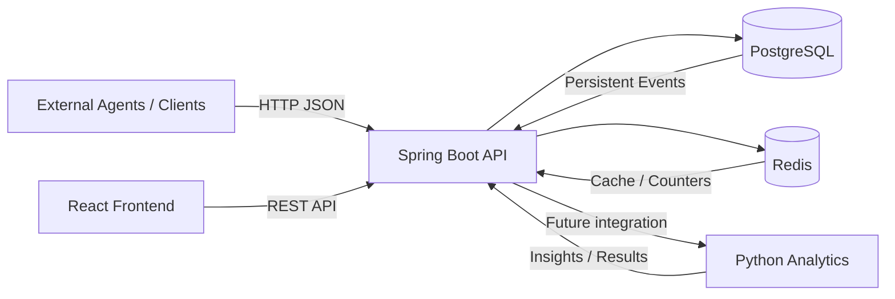

# SentinelFlow - Architecture Diagram

## High-Level Architecture

## Main Responsibilities

### External Clients

Send monitoring events to SentinelFlow.

### Spring Boot API

Acts as the central application layer.

Responsibilities:

- event ingestion
- validation
- business logic
- persistence orchestration
- REST API exposure

### PostgreSQL

Stores persistent application and event data.

### Redis

Stores temporary or performance-oriented data.

### Python Analytics

Processes event information for future analytics and anomaly detection.

### React

Provides dashboards and visualization for users.
